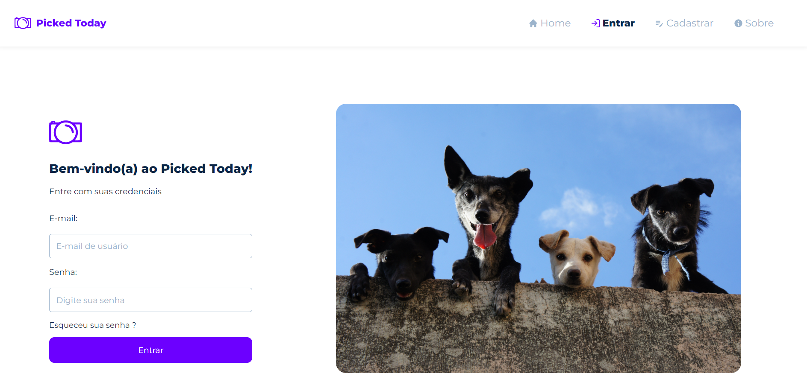

<h1 align="center">Picked Today</h1>

  <a href="#-tecnologias">Tecnologias</a>&nbsp;&nbsp;&nbsp;|&nbsp;&nbsp;&nbsp;
  <a href="#-projeto">Projeto</a>&nbsp;&nbsp;&nbsp;|&nbsp;&nbsp;&nbsp;
  <a href="#-layout">Layout</a>&nbsp;&nbsp;&nbsp;|&nbsp;&nbsp;&nbsp;

 

  

## 🚀 Tecnologias

Esse projeto foi desenvolvido com as seguintes tecnologias:

- HTML 
- CSS
- JavaScript
- React.JS
- Npm
- Firebase

## 💻 Projeto

Este projeto é um blog onde pessoas podem fazer posts de temas sobre elas ou sobre a rotina delas. Construído com React.JS e Google Firebase, repliquei nesse projeto vários recursos que venho estudando em React como Context API, React Router, Hooks, Estados de Erro, Estados de Loading, Validação e Autenticação.

## 🔖 Layout

Você pode visualizar o layout do projeto através [DESSE LINK](https://picked-today.vercel.app/login).
